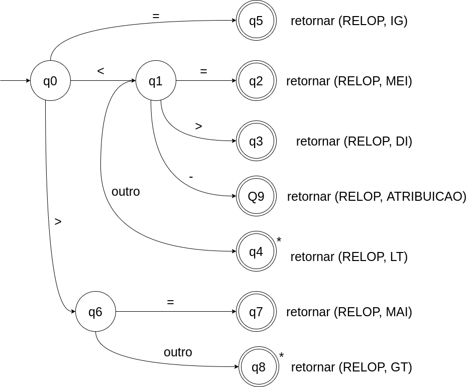
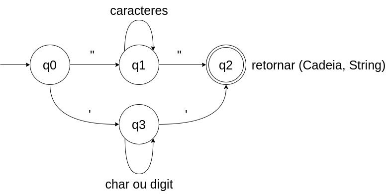
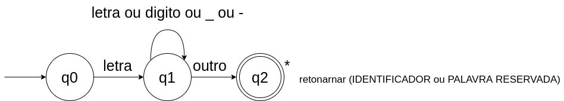
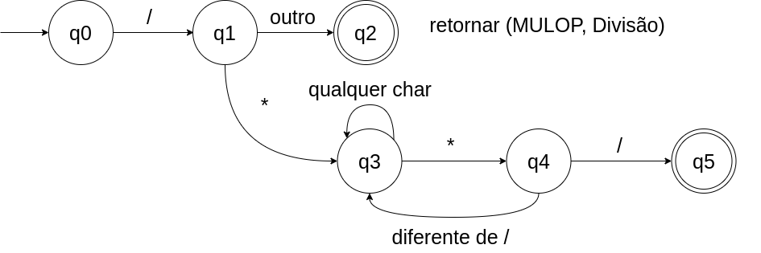

# Compilador de Pseudocódigo

<p> Projeto desenvolvido durante o curso conceitual de compiladores pela <b>Faculdade Impacta</b> na graduação em Engenharia da Computação.</p>

Durante o curso foram apresentados os conceitos por trás dos compiladores, tais como:

* Níveis de linguagens de programação;
* Especificação de linguagens de programação;
* Tipos de processadores de linguagens;
* Técnicas de bootstrapping;
* Fases e passos de compilação;
* Análise léxica;
* Parsing;
* Árvores de sintaxe abstrata;
* Análise de contexto (identificação e verificação de tipos);
* Organização de tempo de execução:
* Representação de dados;
* Avaliação de expressões;
* Alocação de memória;
* Subprogramas;
* Geração de código:
* Constantes e variáveis;
* Subprogramas; 

Devido a limitação de tempo da disciplina, o projeto da mesma se limitou ao desenvolvimento do <b>analidor Léxico e sintático</b>. Futuramento posso dar continuidade ao desenvolvimento com o analisador semantico e geração de codigo assembly para um microprocessaor como o ATmega320P (Arduino).


# Documentação

# Index
```
 1. Analisador Léxico Definições
	 1.1 Exemplo de utilização
	 1.2 Definição dos Átomos que são Palavras Reservadas
	 1.3 Definição dos átomos sem atributos
	 1.4 Definição do átomo OP_LOGICO
	 1.5 Definição do átomo IDENTIFICADOR
	 1.6 Definição do átomo NUMERO_INTEIRO e NUMERO_REAL
	 1.7 Definição do átomo FRASE
	 1.8 Definição do átomo COMENTÁRIO
	 
 2. Funcionamento
	 2.1 Pseudocodigo de teste.
	 2.2 Retorno do Bash ao TESTE.PTL
     2.3 Automatos Finitos Deterministicos implementados durante odesenvolvimento
     2.4 Trata operadores relacionais e atribuição
     2.5 Trata cadeia de texto
     2.6 Trata Identificador e palavras chaves
     2.7 Trata divisão e comentarios
     2.8 Proximo caracter
     2.9 Proximo Tolken

 3. Analisador Sintático Definições
     3.1 Definições da linguagem laboratorio (Portugol)
     3.2 Gramática
     3.3 Pseudocodigo utilizado
     3.4 Retorno dos testes realizados com os arquivos **ex01.ptl** e **ex02.ptl**
 
 4. Implementação do analisador sintático

```
			 


	


# 1 - Analisador Lexíco Definições


## 1.1 - Exemplo de utilização:

Exemplo: Se o programa a ser analisado possuir o nome TESTE.PTL, e o programa fonte sendo lexico.py, a execução deve ser:
```bash
$ python lexico.py TESTE.PTL
```
A rotina **proximo_atomo()** deve fazer um controle das linhas do programa fonte e também fazer a eliminação dos delimitadores (espaços em branco, tabulação, nova linha e retorno de carro). Para cada átomo reconhecido devem ser mostrados os seguintes valores:

## 1.2 Definição dos Átomos que são Palavras Reservadas

As palavras chaves da linguagem são consideradas palavras reservadas, ou seja, não podem ser utilizadas como identificadores. Para simplificar a rotina de análise léxica, o reconhecimento de palavras chaves será feito com base na definição regular de identificadores, sendo que a determinação do átomo associado à palavra chave é feita por uma busca em uma tabela de palavras reservadas. A busca na tabela de palavras reservadas deve ser implementada utilizando um dicionário para tabela de palavras reservadas.

Átomos Retornados | Descrição
-- | -------
ALGORITMO | Inicio do algoritmo
ATE | Inicializa a variável de controle do PARA
CADEIA | Tipo de dado para sequência de caracteres
CARACTER | Tipo de dado para definir um caracter
ENQUANTO | Determina um laço com condição no início
ENTAO | usado no bloco de estrutura de seleção
FACA | usado no bloco de estrutura de repetição
FIM | Fim de um bloco ou do programa
FUNCAO | Determina uma função no algoritmo
INICIO | Início do algoritmo
INTEIRO | Tipo de dado para números inteiros
PARA | Determina um laço com variável de controle
PASSO | Incremento da variável de controle na repetição
PROCEDIMENTO | Determina um procedimento no algoritmo
REAL | Tipo de Dado para números reais ( ponto flutuante )
REF | Operador para de referência para variáveis
RETORNE | Retorna de uma função
SE | Determina uma estrutura de seleção
SENAO | Caso contrário da instrução de seleção
VARIAVEIS | Início do bloco de declaração de variáveis

**Obs: As palavras Reservadas podem ser informadas com caracteres maiúsculos ou minúsculos, ou seja, aLgoriTmo o átomo retornado deve ser ALGORITMO**

## 1.3 - Definição dos átomos sem atributos

Átomo | Lexema
-----|---------
ATRIBUICAO |<-
PONTO | .
ABRE_PAR | (
FECHA_PAR | )
PONTO_VIRGULA | ;
VIRGULA | ,
SUBTRACAO | -
ADICAO | +
MULTIPLICACAO | *
DIVISAO | /
RESTO | %
## 1.4 - Definição do átomo OP_LOGICO

OP_LOGICO → & | $ | !

**Onde o atributo associado ao átomo OP_LOGICO deverá ser as constantes simbólicas:**

Átomo | Lexema
-----|-----
E | &
OU | $
NEG | !
## 1.5 - Definição do átomo IDENTIFICADOR

LETRA → [_A-Za-z]

DIGITO → [0-9]

IDENTIFICADOR → LETRA(LETRA|DIGITO)*

Quando um IDENTIFICADOR é reconhecido, deve-se fazer uma busca na tabela de palavras reservados; se for encontrado, deve-se retornar o átomo associado com a palavra chave; caso contrário, o átomo IDENTIFICADOR deve ser retornado
## 1.6 -  Definição do átomo NUMERO_INTEIRO e NUMERO_REAL

NUMERO_INTEIRO → DIGITOS+

OP_FRACAO → .DIGITOS*

OP_EXP → ( (E|e) ( +| – | λ) DIGITO+)

NUMERO_REAL → NUMERO_INTEIRO OP_FRACAO (OP_EXP | λ)

O atributo para  **NUMERO_INTEIRO**  ou  **NUMERO_REAL**  é o valor da constante numérica que gerou o átomo.
## 1.7 - Definição do átomo FRASE

CHAR1 → {qualquer caractere ASCII menos os caracteres de retorno de carro e avanço de linha }

FRASE → “ CHAR1* ”

Quando a frase tiver “ (aspas) esta deve ser precedida pelo caracter ‘\’. O atributo para  **FRASE**  é um apontador para a cadeia de caracteres.
## 1.8 - Definição do átomo COMENTÁRIO

CHAR2 → {qualquer caractere ASCII }

COMENTARIO → /* CHAR2 */

Para COMENTARIO deve ser retornado átomo correspondente, e o controle de linhas deve ser mantido dentro do comentário. COMENTARIO não possui atributo.

## 2 - Funcionamento

Variaveis Globais

```python
#tolkens da linguagem (tipo do tolken)
ERRO = 0
IDENTIFICADOR = 1
NUM_INT = 2
NUM_REAL = 3
EOS = 4 #fim da cadeia
RELOP = 5 # OPERADORES RELACIONAIS
ADDOP = 6 # OPERADORES DE SOMA E SIBTRAÇÃO
MULOP = 7 #OPERADORES DE MULTIPLICAÇÃO E DIVISÃO
ALGORITMO = 8
ATE = 9
CADEIA = 10
CARACTER = 11
ENQUANTO = 12
ENTAO = 13 
FACA = 14
FIM = 15
FUNCAO = 16
INICIO = 17
INTEIRO = 18
PARA = 19 
PASSO = 20
PROCEDIMENTO = 21
REAL = 22
REF = 23
RETORNE = 24
SE = 25 
SENAO = 26
VARIAVEIS = 27
COMENTARIO = 28
STRING = 29
ATRIBU=30
PONTO = 31 # .
ABRE_PAR = 32 # (
FECHA_PAR = 33 # )
VIRGULA = 34 # ,
PONTO_VIRGULA = 35 # ;

# OPERADOR RELACIONAL
MEI = 1000 # MENOR IGUAL (<=)
DI = 1001 # DIFERENTE (<>)
ME = 1002 # MENOR QUE (<)
MAI = 1003 # MAIOR IGUAL (>=)
MA = 1004 # MAIOR QUE  (>)
IG = 1005 # IGUAL (=)
ADICAO = 1006 # MAIS (+)
SUBTRACAO = 1007 # MENOS (-)
DIVISAO = 1008 # dividir (/)
COMENT = 1009  #  /* COMENTARIOS */
MULTIPLICACAO = 1010 # (*)
ATRIBUICAO = 1011 # ATRIBUIR (<-)
RESTO = 1012 # RESTO DA DIVISAO (%)


E = 1018 # (&)
OU = 1019 # ($)
NEG = 1020 # (!)

```


## 2.1 - Pseudocodigo de teste.
```bash
/*teste*/
AlGoRiTmO programa_teste
VARIAVEIS 
       INTEIRO  X 
INICIO
   IMPRIMA("TESTE\n")
   x <- 0;
   ENQUANTO (X <= 10) ENTAO
      SE (x % 2 = 0) ENTAO
          IMPRIMA(x)
      FIM
      X <- x + 1
   FIM 
FIM
```
## 2.2 - Retorno do Bash ao TESTE.PTL
```bash
┌💁  leandro @ 💻  NAVE in 📁  Compilador on 🌿  main •2 ⌀9 ✗
└❯ python lexico2.py teste.ptl 
Linha: 1 - atomo: ALGORITMO 	lexema: ALGORITMO	valor: 0	operador: --
Linha: 1 - atomo: IDENTIF 	lexema: Exemplo01	valor: 0	operador: --
Linha: 2 - atomo: VARIAVEIS 	lexema: VARIAVEIS	valor: 0	operador: --
Linha: 2 - atomo: INTEIRO 	lexema: INTEIRO	valor: 0	operador: --
Linha: 2 - atomo: IDENTIF 	lexema: x	valor: 0	operador: --
Linha: 2 - atomo: VIRGULA 	lexema: ,	valor: 0	operador: --
Linha: 2 - atomo: IDENTIF 	lexema: y	valor: 0	operador: --
Linha: 2 - atomo: VIRGULA 	lexema: ,	valor: 0	operador: --
Linha: 2 - atomo: IDENTIF 	lexema: z	valor: 0	operador: --
Linha: 3 - atomo: INICIO 	lexema: INICIO	valor: 0	operador: --
Linha: 4 - atomo: IDENTIF 	lexema: x	valor: 0	operador: --
Linha: 4 - atomo: ATRIBUIÇÃO 	lexema: <-	valor: 0	operador: --
Linha: 4 - atomo: NUM_INT 	lexema: 10	valor: 10	operador: --
Linha: 4 - atomo: PONTO_VIRGULA 	lexema: ;	valor: 0	operador: --
Linha: 5 - atomo: IDENTIF 	lexema: y	valor: 0	operador: --
Linha: 5 - atomo: ATRIBUIÇÃO 	lexema: <-	valor: 0	operador: --
Linha: 5 - atomo: IDENTIF 	lexema: x	valor: 0	operador: --
Linha: 5 - atomo: MULOP 	lexema: /	valor: 0	operador: DIVISAO
Linha: 5 - atomo: NUM_INT 	lexema: 100	valor: 100	operador: --
Linha: 5 - atomo: PONTO_VIRGULA 	lexema: ;	valor: 0	operador: --
Linha: 6 - atomo: IDENTIF 	lexema: z	valor: 0	operador: --
Linha: 6 - atomo: ATRIBUIÇÃO 	lexema: <-	valor: 0	operador: --
Linha: 6 - atomo: ABRE_PAR 	lexema: (	valor: 0	operador: --
Linha: 6 - atomo: IDENTIF 	lexema: x	valor: 0	operador: --
Linha: 6 - atomo: ADDOP 	lexema: +	valor: 0	operador: ADICAO
Linha: 6 - atomo: IDENTIF 	lexema: y	valor: 0	operador: --
Linha: 6 - atomo: FECHA_PAR 	lexema: )	valor: 0	operador: --
Linha: 6 - atomo: MULOP 	lexema: /	valor: 0	operador: DIVISAO
Linha: 6 - atomo: ABRE_PAR 	lexema: (	valor: 0	operador: --
Linha: 6 - atomo: IDENTIF 	lexema: x	valor: 0	operador: --
Linha: 6 - atomo: MULOP 	lexema: *	valor: 0	operador: MULTIPLICACAO
Linha: 6 - atomo: NUM_INT 	lexema: 2	valor: 2	operador: --
Linha: 6 - atomo: FECHA_PAR 	lexema: )	valor: 0	operador: --
Linha: 7 - atomo: FIM 	lexema: FIM	valor: 0	operador: --
Linha: 7 - atomo: PONTO 	lexema: .	valor: 0	operador: --
Linha: 7 - atomo: EOS 	lexema: 	valor: 0	operador: --
```
# 2.3 - Automatos Finitos Deterministicos implementados durante o desenvolvimento

## 2.4 - Trata operadores relacionais e atribuição:


```python
def tratar_operador_menor(self, c):
    lexema = c
    estado = 1
    c = self.proximo_char()
    while True:
        # estado 1
        if estado ==1:
            if c == '=':
                lexema = lexema + c
                estado = 2
            elif c =='>':
                lexema = lexema + c
                estado = 3
            
            elif c =='-':
                lexema = lexema + c
                estado = 9
            else:
                estado = 4
        
        # estado 2
        elif estado ==2:
            return Tolken(RELOP, lexema, 0, MEI, self.nlinha)
            

        # estado 3
        elif estado ==3:
            return Tolken(RELOP, lexema, 0, DI, self.nlinha)
            

        # estado 4
        elif estado ==4:
            return Tolken(RELOP, lexema, 0, MA, self.nlinha)

        # estado 9
        elif estado ==9:
            return Tolken(ATRIBU, lexema, 0, 0, self.nlinha)

def tratar_operador_maior(self, c):
    lexema = c
    estado = 6
    c = self.proximo_char()
    while True:
        if estado ==6:
            if c == '=':
                lexema = lexema +c
                estado = 7
            else:
                self.retrac_char()
                estado = 8

        elif estado == 7:
            return Tolken(RELOP,lexema, 0, MAI, self.nlinha) 
        
        elif estado == 8:
            return Tolken(RELOP, lexema, 0, ME, self.nlinha)
```

## 2.5 - Trata cadeia de texto


```python
def tratar_string(self, c):
    lexema = c
    estado = 0
    c = self.proximo_char()

    while True:
        if estado == 0:
            if lexema == '"':
                estado = 1
            else:
                estado = 3

        elif estado == 1:
            if c == '"':
                lexema = lexema + c
                estado = 2
            else:
                lexema = lexema + c
                estado = 1
                c = self.proximo_char()

        elif estado ==2:
            return Tolken(STRING,lexema, 0, 0, self.nlinha)

        elif estado == 3:
            if c == "'":
                lexema = lexema + c
                estado = 2
            else:
                lexema = lexema + c
                estado = 3
                c = self.proximo_char()                
```

## 2.6 - Trata Identificador e palavras chaves


```python
def tratar_identificador(self, c):
    lexema = c
    c = self.proximo_char()
    estado = 1

    while True:
        if estado ==1:
            if c.isdigit() or c.isalpha() or c =='_' or c =='-':
                lexema = lexema + c
                estado = 1
                c = self.proximo_char()
            else:
                estado = 2
        elif estado ==2:
            self.retrac_char()
            if lexema.upper() in palavras_reservadas:
                codigo = palavras_reservadas[lexema.upper()]
                return Tolken(codigo, lexema.upper(), 0, 0, self.nlinha)
            else:
                return Tolken(IDENTIFICADOR, lexema, 0, 0, self.nlinha)
```

## 2.7 - Trata divisão e comentarios


```python
def tratar_divcomentario(self, c):
    lexema = c
    c = self.proximo_char()
    estado = 1

    while True:
        if estado == 1:
            if c == '*':
                estado = 3
                lexema = lexema + c
                c = self.proximo_char()
            else:
                estado =2

        elif estado == 2:
            self.retrac_char()
            return Tolken(MULOP,lexema, 0,DIVISAO, self.nlinha)
        
        elif estado ==3:
            if c == '*':
                estado = 4
                lexema = lexema + c
                c = self.proximo_char()
            else:
                lexema = lexema + c
                estado = 3
                c = self. proximo_char()
        
        elif estado ==4:
            if c =='/':
                lexema = lexema + c
                estado = 5
                #c = self.proximo_char()
            else:
                lexema = lexema + c
                estado = 3
                c = self.proximo_char()

        elif estado ==5:
            return Tolken(COMENTARIO,lexema,0, 0, self.nlinha)
```

## 2.8 - Proximo caracter
Resposável porcapturar o proximo caracter da cadeia
```python
def proximo_char(self):
    c = self.buffer[self.i]
    self.i += 1
    return c
```
## 2.9 Proximo Tolken
Função principal do analisador Léxico, responsavel por devolver os tolkens da linguagem.

```python
    def proximo_tolken(self):
        tolken = Tolken(ERRO, '', 0, 0, self.nlinha)
        c = self.proximo_char()
        
        # Trata os delimitadores
        while c in [' ', '\n','\0']:
            
            if c == '\n':
                self.nlinha +=1
            
            if c =='\x00':
                return Tolken(EOS, '', 0, 0, self.nlinha)
            
            c = self.proximo_char()
        #Tratar os outros Tolkens aqui
        if c.isdigit():
            return self.tratar_numero(c)
            
        elif c.isalpha():
            return self.tratar_identificador(c)
        
        elif c =='+':
            return Tolken(ADDOP, '+', 0, ADICAO, self.nlinha)

        elif c == '/':
            return self.tratar_divcomentario(c)

        elif c =='*':
            return Tolken(MULOP, '*', 0, MULTIPLICACAO, self.nlinha)

        elif c =='-':
            return Tolken(ADDOP, '-', 0, SUBTRACAO, self.nlinha)

        elif c == '<':
            return self.tratar_operador_menor(c)

        elif c == '>':
            return self.tratar_operador_maior(c)

        elif c == '%':
            return Tolken(MULOP, c, 0, RESTO, self.nlinha)
        
        elif c == ',':
            return Tolken(VIRGULA, c, 0, 0, self.nlinha)

        elif c == ';':
            return Tolken(PONTO_VIRGULA, c, 0, 0, self.nlinha)

        elif c == '(':
            return Tolken(ABRE_PAR, c, 0, 0, self.nlinha)

        elif c == ')':
            return Tolken(FECHA_PAR, c, 0, 0, self.nlinha)

        elif c == '.':
            return Tolken(PONTO, c, 0, 0, self.nlinha)

        elif c == '=':
            return Tolken(RELOP, c, 0, IG, self.nlinha)

        elif c == "'" or c == '"':
            return self.tratar_string(c)

        elif c == '!':
            return Tolken(RELOP, c, 0, NEG, self.nlinha)

        elif c == '&':
            return Tolken(RELOP, c, 0, E, self.nlinha)

        elif c == '$':
            return Tolken(RELOP, c, 0, OU, self.nlinha)

        return tolken
```


# 3 - Analisador Sintático 

## 3.1 - Definições da linguagem laboratorio (Portugol)
Por conveniência, introduziremos mais uma notação [α] que é equivalente a α|ε, ou seja, indicará que a
cadeia é opcional. Os nossos não-terminais da nossa gramática são nomes em itálico e os símbolos
**terminais** estão em **negrito** ou entre aspas (Ex: **“;”**).

## 3.2 - Gramática

programa ::= **algoritmo identificador** bloco

bloco ::= [ declaracao_de_variaveis ]
[ declaracao_de_modulo ]
**inicio** comando_composto **fim “.”**

declaracao_de_variáveis ::= **variaveis** tipo_simples lista_de_identificadores
{ tipo_simples lista_de_identificadores }

tipo_simples ::= **inteiro** | **real** | **caracter** | **cadeia**

lista_de_identificadores ::= **identificador** { **“,” identificador** }

declaracao_de_modulo ::= declaração_de_função | declaração_de_procedimento

declaracao_de_função ::= **funcao** tipo_simples **identificador** parametros_formais
[ declaracao_de_variaveis ] **inicio** comando_composto **fim** [ declaração_de_modulo ]

declaracao_de_procedimento ::= **procedimento identificador** parametros_formais
[ declaracao_de_variaveis ] **inicio** comando_composto **fim** [ declaração_de_modulo ]

parametros_formais ::= **“(”** secao_parametros { **“;”** secao_parametros } **“)”**

secao_parâmetros ::= tipo_simples [ **ref** ] lista_de_identificadores | **vazio**

comando_composto ::= comando { **“;”** comando }

comando ::= [ comando_atribuicao |
chamada_modulo |
comando_se |
comando_enquanto |
comando_retorne ]

comando_atribuicao ::= **identificador** “<-” expressao

chamada_modulo ::= **identificador** [**“(”** lista_expressao **“)”** ]

comando_se ::= **se** expressao **então** comando_composto
[ **senão** comando_composto ] **fim** “–” **se**

comando_enquanto ::= **enquanto** expressao **faça** comando_composto **fim “–” enquanto**

comando_retorne ::= retorne expressao

lista_expressao ::= expressao {**“,”** expressao}

expressao ::= expressao_simples { operador_logico expressao_simples}

operador_logico ::= **“&”** | **“$”**

expressão_simples ::= termo_relacional { operador_relacional termo_relacional }

operador_relacional ::= **“<>” | “<” | “>” | “<=” | “>=” | “=”**

termo_relacional ::= termo { operador_adicao termo }

operador_adicao ::= **“+” | “-”**

termo ::= fator { operador_multiplicacao fator }

operador_multiplicacao ::= **“*” | “/” | “%”**

fator ::= **identificador** [ **“(”** lista_expressao **“)”** ]
| **numero_inteiro**
| **numero_real**
| **frase**
| **“!”** fator
| **“-”** fator
| **“(”** expressao **“)”**

## 3.3 - Pseudocodigo utilizado
 ex01.ptl:
```portugol
algoritmo Exemplo01
variaveis inteiro x, y, z
inicio
    x <- 10;
    y <- x / 100;
    z <- (x + y) / (x * 2)
fim.
```

 ex02.ptl:
```portugol
algoritmo Exemplo02
variaveis inteiro x, y, z

funcao inteiro soma (inteiro a, inteiro b)
inicio
   retorne a + b
fim 

inicio
    x <- 10;
    y <- x / 100;
    z <- (soma(x, y) / (x * 2))
fim.
```
## 3.4 - Retorno dos testes realizados com os arquivos **ex01.ptl** e **ex02.ptl**
```bash
┌💁  leandro @ 💻  NAVE in 📁  Compilador on 🌿  main •1 ⌀9 ✗
└❯ python sintatico.py ex01.ptl 
fim da analise sintatica

┌💁  leandro @ 💻  NAVE in 📁  Compilador on 🌿  main •1 ⌀9 ✗
└❯ python sintatico.py ex02.ptl 
erro de sintaxe linha: 4, era esperado tolken do tipo:IDENTIF, foi recebido o tipo INTEIRO
```

# 4. Implementação do analisador sintático

## Variaveis Globais
```python
i = 0
lookahead = 0
atributos_tolken = {}
lexico = {}
atributos_atomo = None
```

## erro()
Função responsável por retornar o erro informando qual o tipo que o compilador estava esperando e qual tipo de tolken recebeu
```python
def erro(atomo):
    global atributos_tolken
    global tolken_msg
    print(f'erro de sintaxe linha: {atributos_tolken.linha}, era esperado tolken do tipo:{tolken_msg[atomo]}, foi recebido o tipo {tolken_msg[lookahead]}')
    quit()
```

## Consome Tolken
### Responsável por consumir o tolken, ou gerar o erro sintatico quando a condição no for respeitada.
```python
def consome(atomo):
    global lookahead
    global lexico
    global atributos_tolken
    if (atomo == lookahead):
        if atomo != EOS:
            atributos_tolken = lexico.proximo_tolken()
            lookahead = atributos_tolken.tipo
    else:
        try:
            raise
        except Exception as e:
            erro(atomo)
```


## SINTATICO
### 
```python
def sintatico():
    global lookahead
    global lexico
    global atributos_tolken

    atributos_tolken = lexico.proximo_tolken()
    lookahead = atributos_tolken.tipo
    PROGRAMA()
    consome(EOS)
    print('fim da analise sintatica')
```

## PROGRAMA()
### programa ::= ***algoritmo identificador***  _bloco_
```python
def PROGRAMA():
    global lookahead
    consome(ALGORITMO)
    consome(IDENTIFICADOR)
    BLOCO()
```

## BLOCO()

### bloco ::= [ _declaracao_de_variaveis_ ][ _declaracao_de_modulo_ ] **inicio** _comando_composto_ **fim “.”**

```python
def BLOCO():
    global lookahead
    if lookahead == VARIAVEIS:
        DECLARA_VAR()
    if lookahead == FUNCAO or lookahead ==PROCEDIMENTO:
        DECLARA_MOD()
    consome(INICIO)
    COMANDO_COMPOSTO()
    consome(FIM)
    consome(PONTO)
```

## DECLARA_VAR()

### _declaracao_de_variáveis_ ::= **variaveis** _tipo_simples_ _lista_de_identificadores_ { _tipo_simples_ _lista_de_identificadores_ }

```python
def DECLARA_VAR():
    consome(VARIAVEIS)
    TIPO_SIMPLES()
    LISTA_DE_INDENTIFICADORES()
    while lookahead == INTEIRO or lookahead == REAL or lookahead == CARACTER or lookahead == CADEIA:
        TIPO_SIMPLES()
        LISTA_DE_INDENTIFICADORES()
```

## TIPO_SIMPLES()

### _tipo_simples_ ::= **inteiro | real | caracter | cadeia**

```python
def TIPO_SIMPLES():
    if lookahead == INTEIRO:
        consome(INTEIRO)
    elif lookahead == REAL:
        consome(REAL)
    elif lookahead == CARACTER:
        consome(CARACTER)
    elif lookahead == STRING:
        consome(STRING)
```

## LISTA_DE_INDENTIFICADORES()

### _lista_de_identificadores_ ::= **identificador { “,” identificador }**

```python
def LISTA_DE_INDENTIFICADORES():
    consome(IDENTIFICADOR)
    while lookahead == VIRGULA:
        consome(VIRGULA)
        consome(IDENTIFICADOR)
```

## DECLARA_MOD()

### _declaracao_de_modulo ::= declaração_de_função_ | _declaração_de_procedimento_

```python
def DECLARA_MOD():
    if lookahead == FUNCAO:
        DECLARA_FUNCAO()
    elif lookahead == PROCEDIMENTO:
        DECLARA_PROCEDIMENTO()
```

## DECLARA_FUNCAO()

### _declaracao_de_função_ ::= **funcao** _tipo_simples_ **identificador** _parametros_formais_[ _declaracao_de_variaveis_ ] **inicio** _comando_composto_ **fim** [ _declaração_de_modulo_ ]

```python
def DECLARA_FUNCAO():
    consome(FUNCAO)
    TIPO_SIMPLES()
    consome(IDENTIFICADOR)
    PARAMETROS_FORMAIS()
    if lookahead ==VARIAVEIS:
        DECLARA_VAR()
    consome(INICIO)
    COMANDO_COMPOSTO()
    consome(FIM)
    if lookahead == FUNCAO or lookahead == PROCEDIMENTO:
        DECLARA_MOD()
```

## PARAMETROS_FORMAIS()

### _parametros_formais_ ::= **“(”** _secao_parametros_ { **“;”** _secao_parametros_ } **“)”**

```python
def PARAMETROS_FORMAIS():
    consome(ABRE_PAR)
    SECAO_PARAMETROS()
    while lookahead == PONTO_VIRGULA or lookahead == INTEIRO or lookahead == EOS:
        consome(PONTO_VIRGULA)
        SECAO_PARAMETROS()
    consome(FECHA_PAR)
```

## SECAO_PARAMETROS()

### _secao_parâmetros ::= tipo_simples_ [ _ref_ ] _lista_de_identificadores_ | **vazio**

```python
def SECAO_PARAMETROS():
    if lookahead == INTEIRO:
        TIPO_SIMPLES()
        if lookahead == REF:
            consome(REF)
        LISTA_DE_INDENTIFICADORES()
    elif lookahead == EOS:
        consome(EOS)
```

## DECLARA_PROCEDIMENTO()

### _declaracao_de_procedimento_ ::= **procedimento identificador** _parametros_formais_
### [ _declaracao_de_variaveis_ ] **inicio** _comando_composto_ **fim** [ _declaração_de_modulo_ ]

```python
def DECLARA_PROCEDIMENTO():
    consome(PROCEDIMENTO)
    consome(IDENTIFICADOR)
    PARAMETROS_FORMAIS()
    if lookahead == VARIAVEIS:
        DECLARA_VAR()
    consome(INICIO)
    COMANDO_COMPOSTO()
    consome(FIM)
    if lookahead == FUNCAO or lookahead == PROCEDIMENTO:
        DECLARA_MOD()
```

## COMANDO_COMPOSTO()

### _comando_composto_ ::= _comando_ { **“;”** _comando_ }

```python
def COMANDO_COMPOSTO():
    COMANDO()
    while lookahead == PONTO_VIRGULA:
        consome(PONTO_VIRGULA)
        COMANDO()
```

## COMANDO()

### comando ::= [_comando_atribuicao_ |_chamada_modulo_|_comando_se_|_comando_enquanto_|_comando_retorne_]

```python
def COMANDO():
    if lookahead == IDENTIFICADOR:
        COMANDO_ATRIBUICAO()
    elif lookahead == IDENTIFICADOR:
        CHAMADA_MODULO()
    elif lookahead == SE:
        COMANDO_SE()
    elif lookahead == ENQUANTO:
        COMANDO_ENQUANTO()
    elif lookahead == RETORNE:
        COMANDO_RETORNE()
```
## EXPRESSAO()

### _expressao_ ::= _expressao_simples_ { _operador_logico expressao_simples_}

```python
def EXPRESSAO():
    EXPRESSAO_SIMPLES()
    while lookahead == E:
        OPERADOR_LOGICO()
        EXPRESSAO_SIMPLES()
```
## EXPRESSAO_SIMPLES()

### _expressão_simples_ ::= _termo_relacional_ { _operador_relacional_ _termo_relacional_ }

```python
def EXPRESSAO_SIMPLES():
    TERMO_RELACIONAL()
    while lookahead == RELOP:
        OPERADOR_RELACIONAL()
        TERMO_RELACIONAL()
```

## OPERADOR_RELACIONAL()

### _operador_relacional_ ::= **“<>” | “<” | “>” | “<=” | “>=” | “=”**

```python
def OPERADOR_RELACIONAL():
    if lookahead == RELOP:
        consome(RELOP)
```

## TERMO_RELACIONAL()

### _termo_relacional_ ::= _termo_ { _operador_adicao_ _termo_ }

```python
def TERMO_RELACIONAL():
    TERMO()
    while lookahead in [ADICAO, SUBTRACAO, IDENTIFICADOR]:
        OPERADOR_ADICAO()
        TERMO()
```

## TERMO()

### _termo_ ::= _fator_ { _operador_multiplicacao_ _fator_ }

```python
def TERMO():
    FATOR()
    while lookahead == MULOP or lookahead == IDENTIFICADOR:
        OPERADOR_MULTIPLICACAO()
        FATOR()
```

## FATOR()

### fator ::= **identificador** [ **“(”** _lista_expressao_ **“)”** ] | **numero_inteiro** | **numero_real** | **frase** | **“!”** _fator_ | **“-”** _fator_ | **“(”** _expressao_ **“)”**

```python
def FATOR():
    if lookahead == IDENTIFICADOR:
        consome(IDENTIFICADOR)
        if lookahead == ABRE_PAR:
            consome(ABRE_PAR)
            LISTA_EXPRESSAO()
            consome(FECHA_PAR)
    elif lookahead == NUM_INT:
        consome(NUM_INT)
    elif lookahead == NUM_REAL:
        consome(NUM_REAL)
    elif lookahead == STRING:
        consome(STRING)
    elif lookahead == NEG:
        consome(NEG)
        FATOR()
    elif lookahead == SUBTRACAO:
        consome(SUBTRACAO)
    elif lookahead == ABRE_PAR:
        consome(ABRE_PAR)
        EXPRESSAO()
        consome(FECHA_PAR)
```

## LISTA_EXPRESSAO()

### _lista_expressao_ ::= _expressao_ {**“,”** _expressao_}

```python
def LISTA_EXPRESSAO():
    EXPRESSAO()
    while lookahead == PONTO_VIRGULA:
        consome(PONTO_VIRGULA)
        EXPRESSAO()
```

## OPERADOR_MULTIPLICACAO()

### _operador_multiplicacao_ ::= **“*” | “/” | “%”**

```python
def OPERADOR_MULTIPLICACAO():
    if lookahead == MULOP:
        consome(MULOP)
```

## OPERADOR_ADICAO()

### _operador_adicao ::= **“+” | “-”**

```python
def OPERADOR_ADICAO():
    if lookahead == ADDOP:
        consome(ADDOP)
```

## OPERADOR_LOGICO()

### _operador_logico_ ::= **“&” | “$”**

```python
def OPERADOR_LOGICO():
    if lookahead == E:
        consome(E)
    elif lookahead == OU:
        consome(OU)
```

## COMANDO_RETORNE()

### _comando_retorne_ ::= **retorne** _expressao_

```python
def COMANDO_RETORNE():
    consome(RETORNE)
    EXPRESSAO()
```

## COMANDO_ENQUANTO()

### _comando_enquanto_ ::= **enquanto** _expressao_ **faça** _comando_composto_ **fim** **“–”** **enquanto**

```python
def COMANDO_ENQUANTO():
    consome(ENQUANTO)
    EXPRESSAO()
    consome(FACA)
    COMANDO_COMPOSTO()
    consome(FIM)
    consome(SUBTRACAO)
    consome(ENQUANTO)
```

## COMANDO_SE()

### _comando_se_ ::= **se** _expressao_ **então** _comando_composto_ [ **senão** _comando_composto_ ] **fim “–” se**

```python
def COMANDO_SE():
    consome(SE)
    EXPRESSAO()
    consome(ENTAO)
    COMANDO_COMPOSTO()
    if lookahead == SENAO:
        consome(SENAO)
        COMANDO_COMPOSTO()
    consome(FIM)
    consome(SUBTRACAO)
    consome(SE)
```

## CHAMADA_MODULO()

### _chamada_modulo_ ::= **identificador** [**“(”** _lista_expressao_ **“)”** ]

```python
def CHAMADA_MODULO():
    consome(IDENTIFICADOR)
    if lookahead == ABRE_PAR:
        consome(ABRE_PAR)
        LISTA_EXPRESSAO()
        consome(FECHA_PAR)
```

## COMANDO_ATRIBUICAO()

### _comando_atribuicao_ ::= **identificador “←”** _expressao_

```python
def COMANDO_ATRIBUICAO():
    consome(IDENTIFICADOR)
    consome(ATRIBU)
    EXPRESSAO()
```
